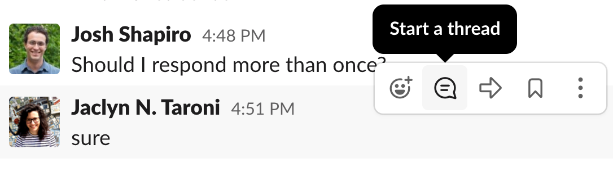
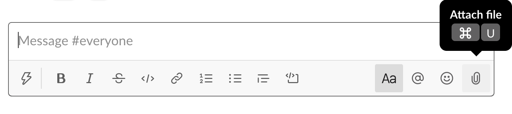
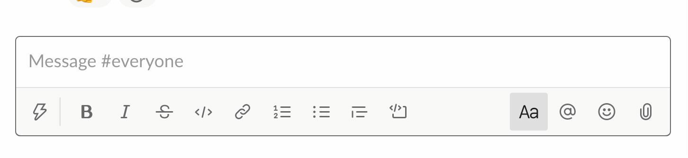

We use the **Cancer Data Science Slack** team administered by the Data Lab.
You can join Cancer Data Science Slack by following this link: [ccdatalab.org/slack](https://www.ccdatalab.org/slack)


All Slack communications must adhere to our [code of conduct](../code-of-conduct.md).

#### Instructions for setting up Slack

We have instructions for setting up Slack for your operating system available.

* [Linux](linux-instructions.md#slack)
* [Mac](mac-instructions.md#slack)
* [Windows](windows-instructions.md#slack)

#### Table of Contents

- [How we use Slack during workshops](#how-we-use-slack-during-workshops)
  - [Using the training-specific channel](#using-the-training-specific-channel)
  - [Using direct messages during training](#using-direct-messages-during-training)
- [After the workshop](#after-the-workshop)
- [General Slack use](#general-slack-use)
    - [Attaching a file or image](#attaching-a-file-or-image)
    - [Adding code blocks to messages](#adding-code-blocks-to-messages)


## How we use Slack during workshops

Course instructors will add you to a private channel specific to your training a few days before the start of your training workshop.

If you are not added to the training specific channel by 3 days prior to the start of training or are having trouble getting started with Slack, please [direct message](#using-direct-messages-during-training) a CCDL staff member (`Stephanie Spielman`, `Ally Hawkins`, `Jen O'Malley` or `Josh Shapiro`) in Cancer Data Science Slack or email [training@ccdatalab.org](mailto:training@ccdatalab.org).

### Using the training-specific channel

You can use the training-specific private channel to post errors and get help with debugging during the workshop.
If you have a question, it's very likely someone else in the course has the same question! 

**Responses to questions should be in [threads](https://slack.com/help/articles/115000769927-Use-threads-to-organize-discussions-) as much as possible**, including any screenshots or images.
To start a thread, hover over the message you want to respond to and click the start a thread icon that appears on the top right of the message:



You can then enter your response in the thread sidebar that appears on the right side of the Slack interface.
In general, you do not want to check the box that sends the message to the entire channel.

For more tips on posting questions about errors you encounter, please see [our guidelines for posting errors to Slack](../workshop/posting-errors-guidelines.md).

**Your instructors may also use the Slack channel to clarify or expand upon questions that came up during the course of the workshop.**

### Using direct messages during training

If you have a question that is **_highly specific_** to your own data, a problem with your RStudio credentials, or encounter issues with locating the room for training, you may [direct message](https://slack.com/help/articles/212281468-What-is-a-direct-message) a CCDL staff member.

First, use the new message button in the top right side corner of the Slack interface.


You are then able to search for the CCDL instructors – `Stephanie Spielman`, `Ally Hawkins`, `Jen O'Malley`, `Josh Shapiro`, or `Jaclyn Taroni` – and compose your message.

Course instructors may direct you to the training-specific channel for more general questions or to another instructor where appropriate.

## After the workshop

After the workshop, you'll have access to the training-specific private channel indefinitely. 
Please note that messages will only be retained for 90 days (a limitation of the Slack plan we use).

Your instruction team will use the channel to hold office hours and announce other consultation opportunities in the future.


## General Slack use

In this section, we include a collection of tips that you may find helpful for using throughout training that were not covered above.

#### Attaching a file or image

You can [add a file or image to Slack](https://slack.com/help/articles/201330736-Add-files-to-Slack) by dragging a file to the Slack window or by using the paper clip icon next to the message field:



#### Adding code blocks to messages

Code and error messages are usually easier to read when you use code formatting in Slack.
You can either select the code block icon below the message field:


Or you can type three backticks <code>```</code> into the message field and formatting will be applied:



You are then ready to paste your code or error message into the grey code block.

**If you have questions or are having trouble with Slack features, please reach out to us via direct message or, if direct messaging is not working, please email [training@ccdatalab.org](mailto:training@ccdatalab.org).**
